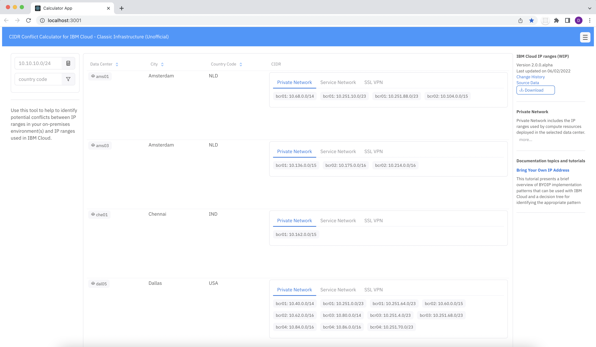

# calculator



### Run on Code Engine

1. Target your desired region.
  ```sh
    ibmcloud target -r us-east -g default
  ```

2. Create the Code Engine project.
  ```sh
    ibmcloud code-engine project create --name calculator
  ```

3. Create a configmap for the list of data centers (json file).
  ```sh
    ibmcloud code-engine configmap create \
    --name datacenters.json \
    --from-file ./data/datacenters.json 
  ```

4. Create the application from an existing container image, expose port 3000 and map the configmap to a volume. 
  ```sh
    ibmcloud code-engine app create -n calculator \
    --image docker.io/dprosper/calculator \
    --port 3000 \
    --mount-configmap /data=datacenters.json
  ```

5. Optional - Update configmap 
  ```sh
    ibmcloud code-engine configmap update \
    --name datacenters.json \
    --from-file ./data/datacenters.json 
  ```

6. Optional - Update the application from an existing container image, exposer port 3000 and map the configmap to a volume. 
  ```sh
    ibmcloud code-engine app update -n calculator \
    --image docker.io/dprosper/calculator \
    --port 3000 \
    --mount-configmap /data=datacenters.json
  ```

### Build and run locally 

#### Build image
```sh
  docker build -t dprosper/ic-cidr-calculator -f ./frontend-api/Dockerfile .
```

### Run local
```sh
  docker run --rm -v $(pwd)/data:/data -v $(pwd)/networks:/networks -p 3000:3000 dprosper/ic-cidr-calculator
```

### Build and run on Pull Request

Submit a pull request and the code will be deployed to Code Engine to facilitate the review.